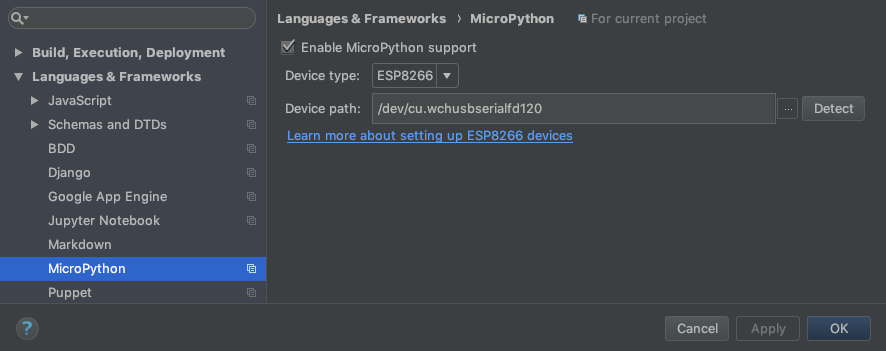
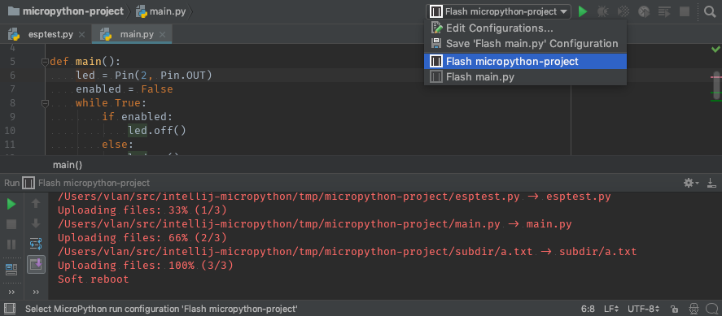
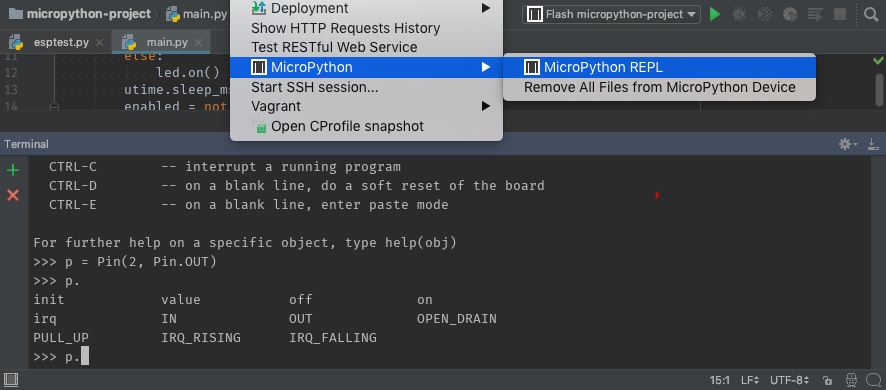

## Installation

1. Install the "MicroPython" plugin from your IDE settings.

2. The setup steps differ for IntelliJ and PyCharm:
* IntelliJ: Add the MicroPython facet to a Python module in your project structure
* PyCharm: Enable MicroPython support in <em>"File | Settings | Languages & Frameworks | MicroPython"</em>

  

### Run code on MicroPython devices

* Flash Python files to devices
    * Use "MicroPython" run configurations to flash files or folders in <em>"Run | Edit Configurations..."</em> menu

      

* MicroPython REPL
    * Use <em>"Tools | MicroPython | MicroPython REPL"</em> menu to run a MicroPython shell on your device

      

### Original instruction
* [intellij-micropython](https://github.com/vlasovskikh/intellij-micropython)